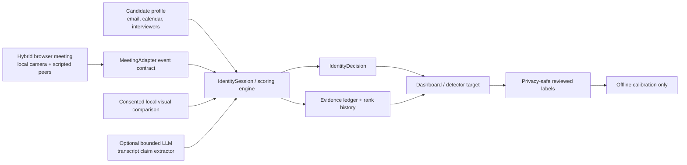

# Architecture

## Runtime path

1. A meeting adapter normalizes platform data into typed events. The demo adapter generates those events from scenario controls and browser media state.
2. `IdentitySession` retains stable participant IDs through display-name changes and computes evidence after every event.
3. The scoring engine caps each evidence category, includes an unknown-candidate baseline, ranks all active participants, and applies confidence, margin, and independent-evidence gates.
4. WebSocket snapshots update the dashboard. Only an `identified` decision has a `detectorTargetParticipantId`; all ambiguous decisions are explicitly unassigned.

## Production evolution

Replace the demo adapter with per-platform ingest workers and publish the same event contract to an event bus. Keep the deterministic evidence service stateless, persist event history and reviewed outcomes in separate privacy-controlled stores, and version/calibrate weights offline using held-out labeled meetings. Candidate identity should remain a gate in front of downstream fraud detectors, never a hidden assumption inside them.
